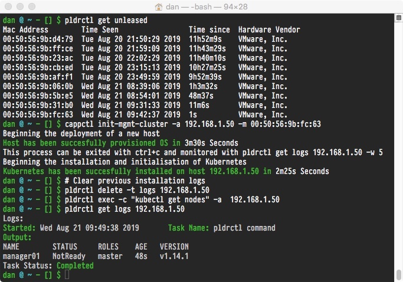

# cappctl

**WIP**

This tool intends to help solve the chicken and egg problem, Cluster-API from the Kubernetes project uses a Kubernetes cluster to deploy and manage further Kubernetes clusters.. However where does the first cluster come from. `cappctl` will use plunder to deploy your first cluster, at which point `cluster-api` will be used to deploy further clusters.

**NOTE** This tooling has been seperated from the `cluster-api-provider-plunder` repository do simplify the issues with one project using go modules and the other not, they may be merged in the future.

At this time the initial `cappctl` tooling can only be used to handle the initial deployment of the first Kubernetes node.

## Getting the cluster-api-provider-plunder CLI tooling

Geting the cluster api provider:

`go get github.com/plunder-app/cappctl` 

Building the initial boot strap tooling:

`make install`

This will install the `cappctl` tool in the `./bin` directory. 

## Usage

The `plunder` client configuration will be needed in the current working directory, in order for the tooling to successfully communicate.

### Find a server

`pldrctl get unleased` will return a list of servers that are currently unprovisioned

### Bootstrap first node

Pass the Mac address and an IP address to the `cappctl` tool to bootstrap the first Kubernetes node.

`cappctl init-mgmt-cluster -a 192.168.1.2 -m 00:11:22:33:44:55`

